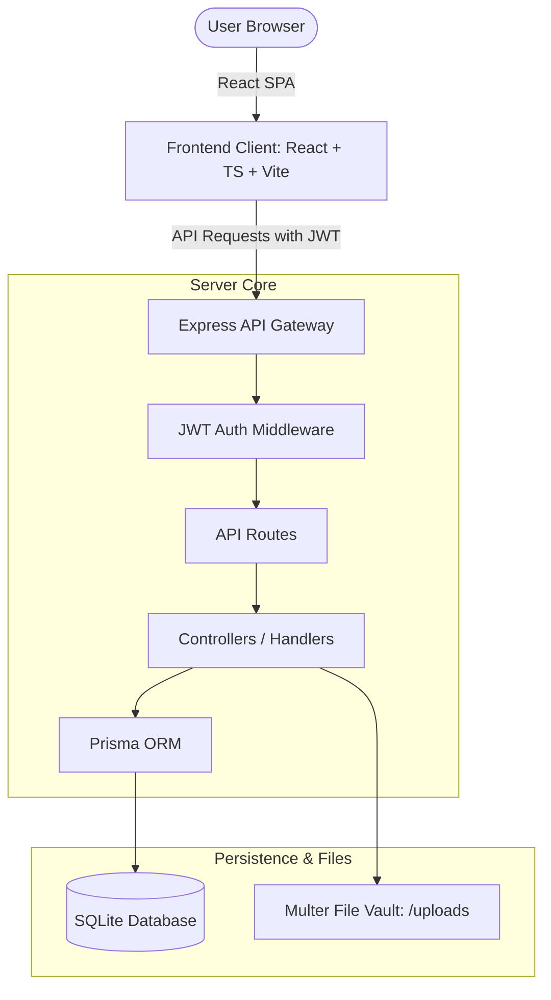

# 🛡️ Life Admin Dashboard

A comprehensive, production-ready, full-stack Personal Management Dashboard designed to centralize and manage critical life components: **Authentication, Bills, Insurance, Documents, Subscriptions, Reminders, and Analytics**.

Built using **React, TypeScript, Node.js (Express), Prisma ORM, and SQLite**, the application is fully containerized, secure, and ready for deployment.

---

## 📸 System Architecture



---

## 🌟 Modules & Features

### 🔐 1. Authentication
*   **Complete Flow**: Registration, login, logout, and password reset.
*   **Security**: SHA-256 password hashing and JWT-based session tokens.
*   **Data Isolation**: Strict user-specific row-level filtering inside database queries.
*   **Protected Routes**: Automatic route redirection for unauthenticated sessions.

### 📊 2. Dashboard & Core Analytics
*   **Projections**: Automatic pro-rated monthly run-rate calculations for bills, insurance, and subscriptions.
*   **Due Alerts**: Live notification banner highlighting items due in 7 or 30 days.
*   **Proximity Sorting**: Dynamic due dates feed sorted by date proximity.

### 💳 3. Bills Management
*   **Operations**: Add, Edit, Delete, and Search bills.
*   **Filtering**: Tabs to view All, Upcoming, Paid, or Overdue bills.
*   **Settle Flow**: One-click action to mark pending bills as paid.

### 🛡️ 4. Insurance Vault
*   **Trackers**: Manage policy numbers, coverage amounts, premiums, duration, and renewal deadlines.
*   **Expiry Counter**: Automatically calculates days remaining and badges status accordingly.

### 📁 5. Document Locker
*   **Physical Upload**: Real file uploads utilizing a secure file picker.
*   **Storage & Metadata**: Store uploads securely inside the local file vault with expiry tracking.
*   **Action items**: One-click Document Preview, direct Download, and Metadata edits.

### 🔄 6. Subscriptions Tracker
*   **Cost Analyzer**: Automatically scales weekly/yearly subscriptions into pro-rated monthly values.
*   **Renewals Tracker**: Displays days remaining to prevent unintended auto-renewals.

### 🔔 7. Reminders Hub
*   **Scheduling**: Create high, medium, and low priority tasks.
*   **Recurrence**: Support for one-time, daily, weekly, monthly, and yearly recurring schedules.
*   **System Notifications**: Uses the browser's native Notification API to trigger desktop alerts.

---

## 📂 Project Structure

```
Life-Admin-Dashboard/
├── client/                 # Frontend React App
│   ├── src/
│   │   ├── components/     # Layouts (Sidebar, Header, AI assistant)
│   │   ├── modules/        # Dashboard panels (Bills, Insurance, Reminders, etc.)
│   │   ├── store/          # Zustand auth state store
│   │   ├── utils/          # Axios client configuration
│   │   └── App.tsx         # Main entry point & routers
│   ├── vite.config.ts      # Vite development server proxies
│   └── package.json
├── server/                 # Backend Node.js Service
│   ├── src/
│   │   ├── middleware/     # JWT authentication middleware
│   │   ├── routes/         # Express API controllers
│   │   ├── utils/          # Database client connections
│   │   ├── seed.ts         # Initial database seeding script
│   │   └── index.ts        # App server initialization
│   ├── prisma/             # Prisma schema and SQLite database
│   └── package.json
├── LICENSE                 # MIT License File
└── README.md               # Main Documentation
```

---

## 🛠️ Installation & Setup

### 1. Prerequisites
*   Node.js (v18 or higher)
*   npm (v9 or higher)

### 2. Configure Environment Files
Create a `.env` file inside the `server/` directory:
```env
PORT=5000
DATABASE_URL="file:./dev.db"
JWT_SECRET="your_super_secret_jwt_key_here"
```

Create a `.env` file inside the `client/` directory:
```env
VITE_API_URL="http://localhost:5000"
```

### 3. Install Server & Database Setup
```bash
cd server
npm install

# Run database schema push & generate Prisma client
npm run prisma:push
npm run prisma:generate

# Seed database with default admin credentials
# Admin Login: admin@lifeadmin.ai | Password: admin123
npx ts-node src/seed.ts
```

### 4. Install Client Setup
```bash
cd ../client
npm install
```

### 5. Launch Development Servers
Run the backend Express service (Port 5000):
```bash
cd server
npm run dev
```

Run the frontend Vite server (Port 5173):
```bash
cd client
npm run dev
```
Open [http://localhost:5173](http://localhost:5173) in your browser.

---

## 🗄️ Database Schema & Migrations

If you need to make changes to the database structure:
1. Update `server/prisma/schema.prisma`.
2. Apply changes to the database:
   ```bash
   npx prisma db push
   ```
3. Regenerate client bindings:
   ```bash
   npx prisma generate
   ```

*To switch to **PostgreSQL** in production, update the `datasource db` provider in `schema.prisma` to `postgresql` and replace `DATABASE_URL` with your postgres connection string.*

---

## 🔌 API Documentation

All routes (except Auth endpoints) require the header `Authorization: Bearer <JWT_TOKEN>`.

### Authentication
*   `POST /api/auth/register` - Create a new account.
*   `POST /api/auth/login` - Authenticate credentials and retrieve JWT token.
*   `POST /api/auth/reset-password` - Reset password for an account.
*   `PUT /api/auth/profile` - Update authenticated user name or password.

### Modules APIs
*   `GET /api/bills` | `POST /api/bills` | `PUT /api/bills/:id` | `DELETE /api/bills/:id`
*   `GET /api/insurance` | `POST /api/insurance` | `PUT /api/insurance/:id` | `DELETE /api/insurance/:id`
*   `GET /api/documents` | `POST /api/documents/upload` | `DELETE /api/documents/:id`
*   `GET /api/subscriptions` | `POST /api/subscriptions` | `PUT /api/subscriptions/:id` | `DELETE /api/subscriptions/:id`
*   `GET /api/reminders` | `POST /api/reminders` | `PUT /api/reminders/:id` | `DELETE /api/reminders/:id`
*   `GET /api/analytics` - Computes monthly expenses summaries, upcoming bills, expirations, and pie-chart distributions.

---

## 🚀 Production Deployment Guide

### SQLite Persistent Disk Volumes
SQLite databases are file-based. On hosting platforms with ephemeral filesystems (like Vercel or standard Render/Railway instances), database changes will vanish on restarts.
To persist your data in production:
1. Provision a **Persistent Disk/Volume** (e.g., size 1GB) on your server instance.
2. Mount the volume to `/data` (or any custom path).
3. Set your production environment variable:
   `DATABASE_URL="file:/data/dev.db"`
4. In `server/src/utils/db.ts`, make sure the Prisma sqlite client points to `process.env.DATABASE_URL`.

---

## ⚖️ License

Distributed under the MIT License. See `LICENSE` for details.
